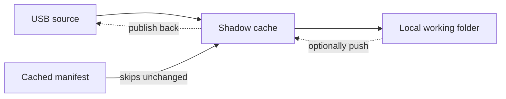

ShadowSync

# USB to PC mirroring with a fast staging cache

ShadowSync keeps your USB folders mirrored on the work machine without copying everything every time. The tray icon watches for a configured drive, syncs only what changed, and keeps a shadow cache ready for safe pushes and fast ejections.

-   ### Start fast
    Plug a USB drive, point the config at it, and ShadowSync automatically picks up new files every few seconds.

-   ### USB stays primary
    Pull sync keeps the USB side as the source until you explicitly choose to push changes back.

-   ### Shadow cache
    All transfers land in the shadow folder before they touch your live workspace, so you can eject at any time.

-   ### Tray + wizard control
    Right-click for `Sync from USB now`, `Sync to USB now`, show logs, or reopen the setup wizard when the config is corrupted.

## How data moves

ShadowSync normally pulls from the USB into the shadow cache and then into your working folder. If you enable push-back, the same cache is reused as the staging layer in the opposite direction.

## Quick start checklist

1. Follow the [Getting Started guide](getting-started.md) to install or unzip ShadowSync for your platform.
2. Use the setup wizard to declare the USB job (the source lives on the drive, the target is your working folder).
3. Watch the tray for progress—if another instance is running you get a safety prompt, and the wizard reopens if the config breaks.
4. Use the `Sync to USB now` menu when you want to publish edits; the shadow cache reuses the same staging area.
5. Eject from the tray when you are done. ShadowSync will run the configured post-sync commands and optionally clear the cache.

## Learn more

- `Configuration` explains how jobs, polling, and shadow options behave.
- `Tray App` covers the context menu, double-instance guard, and the wizard.
- `Sync model` deep dives on delete rules, manifest caching, and shadow rebuilds.
- `Reset and Cleanup` gives the scripts for Windows, macOS, and Linux.
- `Installer and Releases` and `Release Artifacts` live under the Developer section if you're curious how the packages are assembled.

