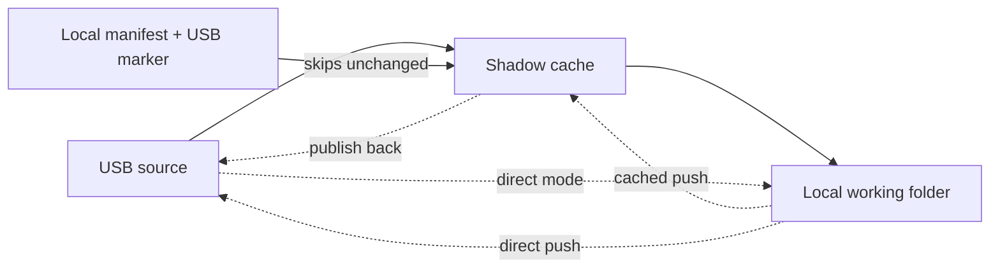

ShadowSync

# USB to PC mirroring with a fast staging cache

ShadowSync keeps your USB folders mirrored on the work machine without copying everything every time. The tray icon watches for a configured drive, syncs only what changed, and keeps a shadow cache ready for safe pushes and fast ejections.

-   ### Start fast
    Plug in a USB drive, pick the real source folders in the wizard, and ShadowSync infers the mounted drive from those paths.

-   ### USB stays primary
    Pull sync keeps the USB side as the source until you explicitly choose to push changes back.

-   ### Shadow cache
    Each job can stage through a shadow cache or run direct. Cached jobs reuse a local staging folder for faster repeat syncs.

-   ### Tray + wizard control
    Right-click for `Sync from USB now`, `Sync to USB now`, update checks, logs, or the recovery wizard when the config breaks.

## How data moves

ShadowSync can run in two modes per job:

- Cached mode: `USB -> shadow -> local` and `local -> shadow -> USB`
- Direct mode: `USB -> local` and `local -> USB`

The wizard now writes absolute USB source folders for each job and derives the drive root from those paths. Hand-edited configs can still use relative `source` values if `drive.letter` or `drive.path` is set.

## Quick start checklist

1. Follow the [Getting Started guide](getting-started.md) to install or unzip ShadowSync for your platform.
2. Use the setup wizard to declare each USB job with an absolute USB source folder and an absolute local target folder.
3. Watch the tray for progress—if another instance is running you get a safety prompt, and the wizard reopens if the config breaks.
4. Use the `Sync to USB now` menu when you want to publish edits; cached jobs reuse the same staging area and direct jobs write straight to the USB.
5. Eject from the tray when you are done. If `eject_after_sync` is enabled, a successful sync can also eject automatically.

## Learn more

- `Configuration` explains how jobs, polling, and shadow options behave.
- `Tray App` covers the context menu, double-instance guard, and the wizard.
- `Sync model` deep dives on delete rules, manifest caching, and shadow rebuilds.
- `Reset and Cleanup` gives the scripts for Windows, macOS, and Linux.
- `Installer and Releases` and `Release Artifacts` live under the Developer section if you're curious how the packages are assembled.

