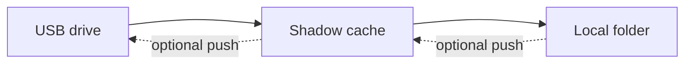

USB file sync

# USB Mirror Sync

USB Mirror Sync is a small tray app that keeps selected folders from a USB drive copied to your computer without re-copying everything every time.

It is built for a simple flow: plug in the drive, sync what changed, and safely eject when you are done.

-   ### Pull-First by Default

    **Normal sync path:** `USB -> shadow cache -> local folder`

    This keeps the USB as the source side for import and uses the shadow cache as staging.

-   ### Optional Publish Back to USB

    **Optional push path:** `local folder -> shadow cache -> USB`

    You can keep that manual or turn on automatic push-back later.

-   ### Incremental by Design

    The app keeps a manifest so unchanged files are skipped and later syncs stay fast.

-   ### Built for the Tray

    Start a sync, open the mounted drive, inspect the shadow cache, open logs, or launch setup from the tray icon.

## At a Glance

The normal path is from the USB into the shadow cache and then into the local folder you actually use.

If you enable push-back, the same shadow cache is reused as the staging layer in the opposite direction.

## What You Need To Know

- Windows can use a drive letter like `E:`
- macOS and Linux use the mounted USB path instead
- `source` is inside the USB root
- `target` is the real folder on your computer
- `shadow` is a local staging cache, not the live folder you work in

## Typical Use

1. Plug in the USB drive.
2. Let the app sync from USB or run `Sync from USB now`.
3. Work from the local target folder on your computer.
4. If you use push-back, run `Sync to USB now` or let auto-push handle it.
5. Eject the drive when you are done.

## Start Here

- New user: [Getting Started](getting-started.md)
- Need to tweak settings by hand: [Configuration](configuration.md)
- Want to understand delete rules and the cache: [How It Works](sync-model.md)
- Need to wipe local app state: [Reset and Cleanup](reset-and-cleanup.md)
